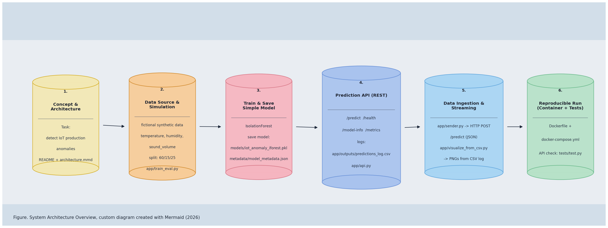
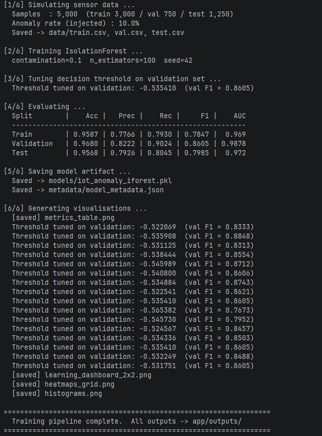
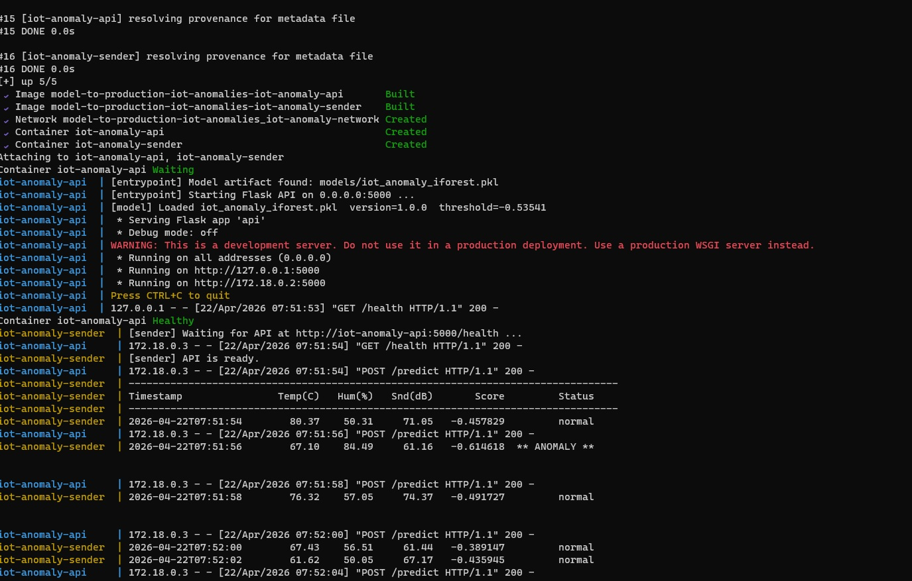
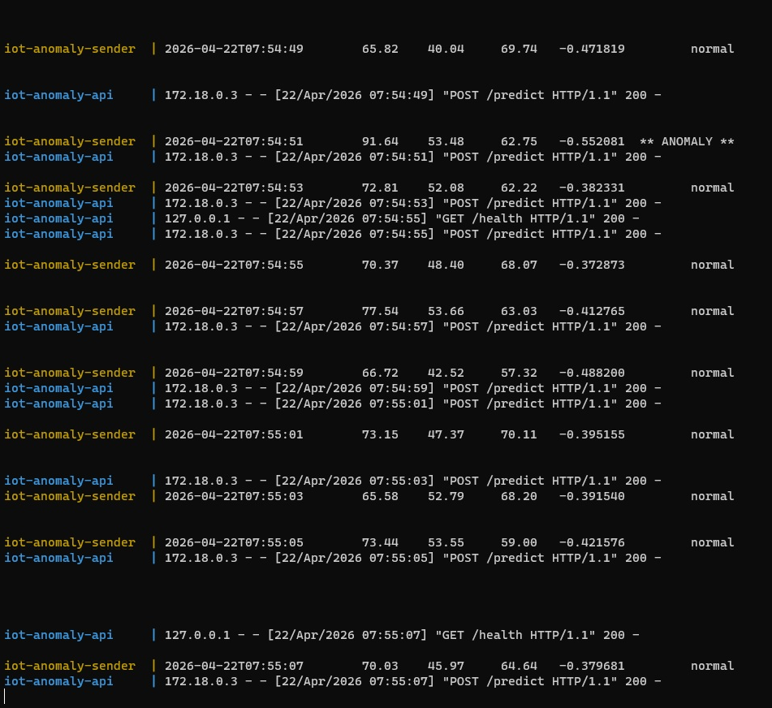
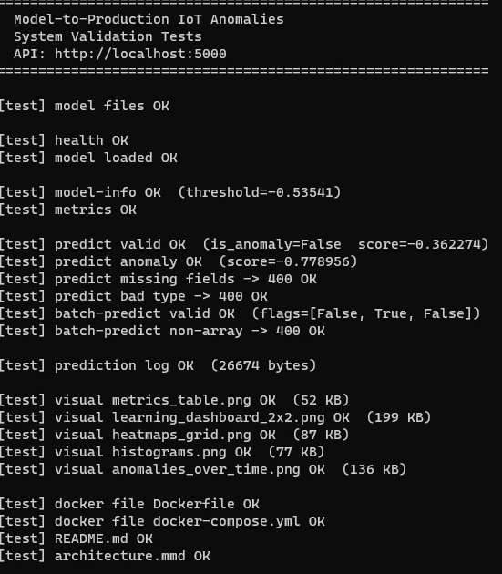
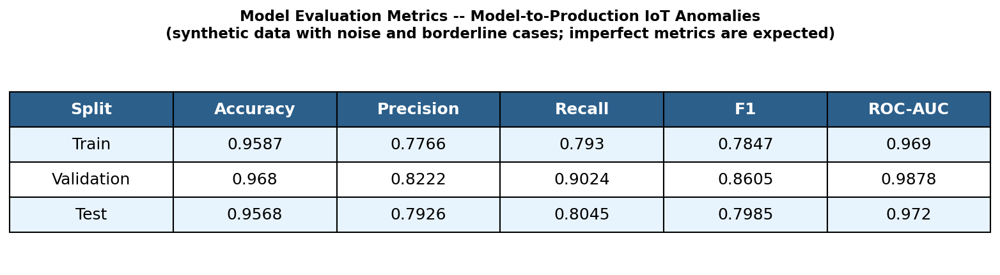
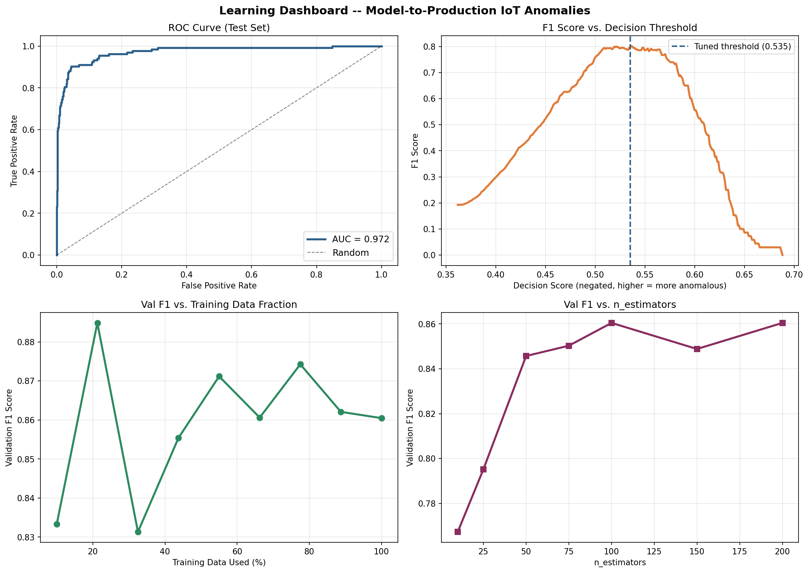
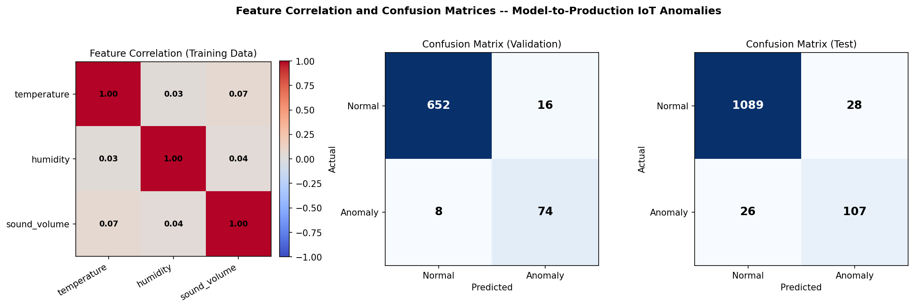
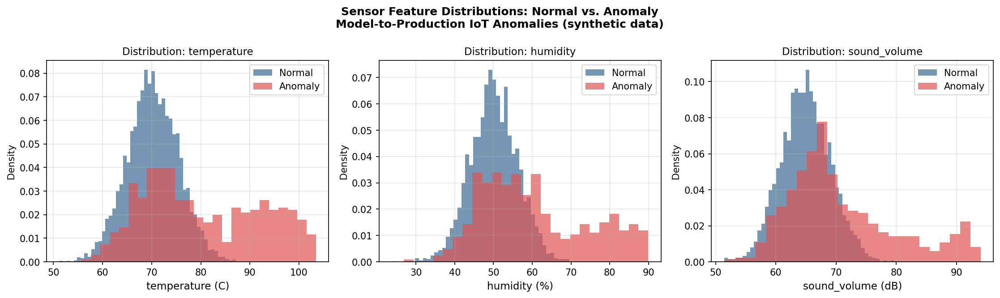
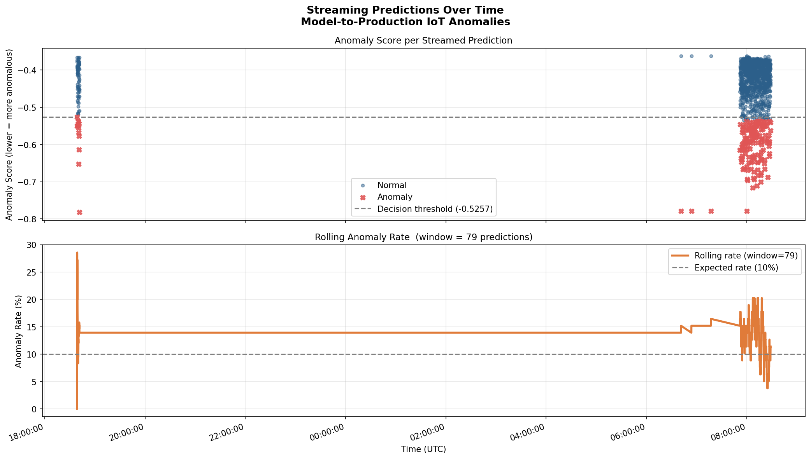

# Model-to-Production IoT Anomalies


This repository contains a prototype for stream-based IoT anomaly detection.
The scenario is a wind turbine component factory with three sensor channels:
`temperature`, `humidity`, `sound_volume`.

## System Architecture



---

## Quick Repro

If you only want to verify the project quickly after cloning:

```bash
python -m app.train_eval
docker compose up --build
python tests/test.py
```

Expected result:
- model artifact + metadata are created
- API and sender run in Docker
- test script reports all checks passed

---

## Local Setup

```bash
git clone https://github.com/Danielkis97/Model-to-Production-IoT-Anomalies.git
cd Model-to-Production-IoT-Anomalies

python -m venv .venv && .venv\Scripts\activate   # Windows
# source .venv/bin/activate                       # Linux / macOS

pip install -r requirements.txt
```

Run pipeline manually:

```bash
python -m app.train_eval
python -m app.api
python -m app.sender
python -m app.visualize_from_csv
python tests/test.py
```

---

## Docker Run

```bash
docker compose up --build
docker compose up -d
docker compose down
```

Services:

| Service | Purpose | Port |
|---|---|---|
| `iot-anomaly-api` | Flask REST API for prediction | `5000` |
| `iot-anomaly-sender` | Continuous sensor stream sender | outbound only |

---

## Project Structure

```text
Model-to-Production-IoT-Anomalies/
|-- app/
|   |-- api.py
|   |-- model.py
|   |-- sender.py
|   |-- train_eval.py
|   `-- visualize_from_csv.py
|-- app/outputs/
|-- data/
|-- models/
|-- metadata/
|-- tests/
|   `-- test.py
|-- docs/
|   |-- architecture.mmd
|   |-- system_architecture_custom.png
|   `-- screenshots/
|-- Dockerfile
|-- docker-compose.yml
`-- requirements.txt
```

---

## Workflow Summary

Training flow:

```text
simulate_sensor_data()
-> split 60/15/25
-> IsolationForest.fit(X_train)
-> threshold tuning on validation set
-> evaluate on held-out test set
-> save model + metadata + visuals
```

Inference flow:

```text
sender payload
-> POST /predict
-> score_samples + threshold decision
-> JSON response
-> append row to app/outputs/predictions_log.csv
```

---

## Metadata

The `metadata/` folder documents model, data, service, and project assumptions:

- `metadata/model_metadata.json`
- `metadata/dataset_metadata.json`
- `metadata/service_metadata.json`
- `metadata/project_metadata.md`

This makes the prototype easier to maintain and easier to review.

---

## API Endpoints

Main endpoints:

- `GET /health`
- `GET /model-info`
- `GET /metrics`
- `POST /predict`

Additional endpoint in implementation/tests:

- `POST /batch-predict`

---

## Execution Evidence

### Output: Training pipeline


### Output: Docker build and launch


### Output: Live logs (API + sender)


### Output: System validation tests


---

## Results and Visuals

Generated files (stored in `app/outputs/`):

- `metrics_table.png`
- `learning_dashboard_2x2.png`
- `heatmaps_grid.png`
- `histograms.png`
- `anomalies_over_time.png`

### Metrics Table


### Learning Dashboard (2x2)


### Correlation and Confusion Matrices


### Feature Histograms


### Anomalies Over Time


---

## Reproducibility Notes

- Split used by current implementation: **60% train / 15% validation / 25% test**.
- Threshold is tuned on validation F1, then applied unchanged to test and runtime predictions.
- Current test suite validates model files, API behavior, visuals, metadata, and Docker files.
- Latest validated test output: **PASS all 29 checks succeeded**.

---

## Development Environment

Validated locally with:

- Windows 11 (PowerShell)
- Python 3.11
- Docker Desktop + Docker Compose v2 (`docker compose`)
- Dependencies from `requirements.txt`

---

## Limitations

- Data is synthetic (fictional), not real factory sensor data.
- Flask development server is used in this prototype.
- Logging is CSV-based (`app/outputs/predictions_log.csv`), no production database.
- No authentication/authorization layer.
- No drift monitoring or scheduled retraining pipeline yet.
- No cloud deployment/hardening in this version.

---

## Conclusion

This project demonstrates an end-to-end model-to-production workflow for IoT anomaly detection:
training, artifact export, REST serving, stream ingestion, Docker reproducibility, and automated validation.
